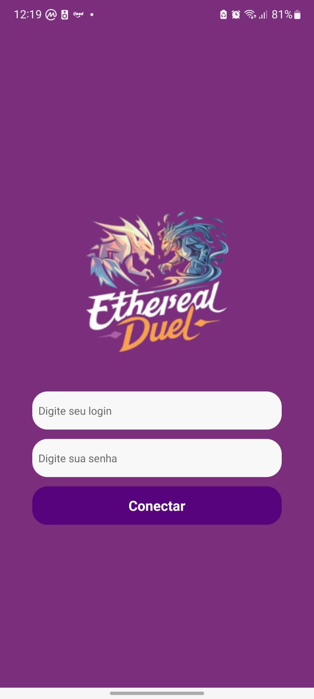
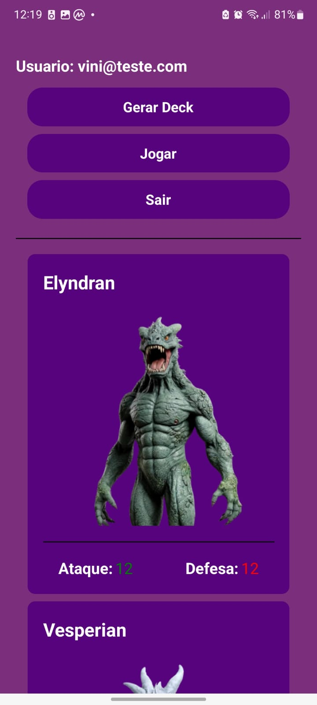
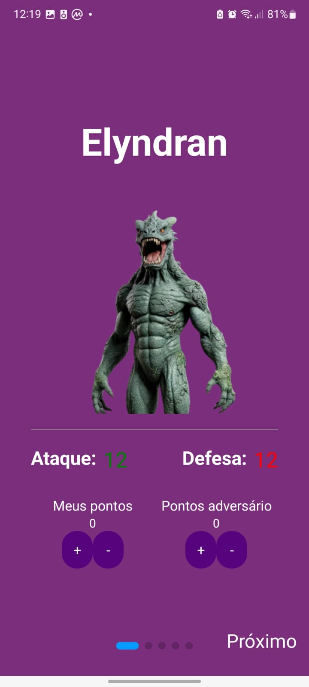
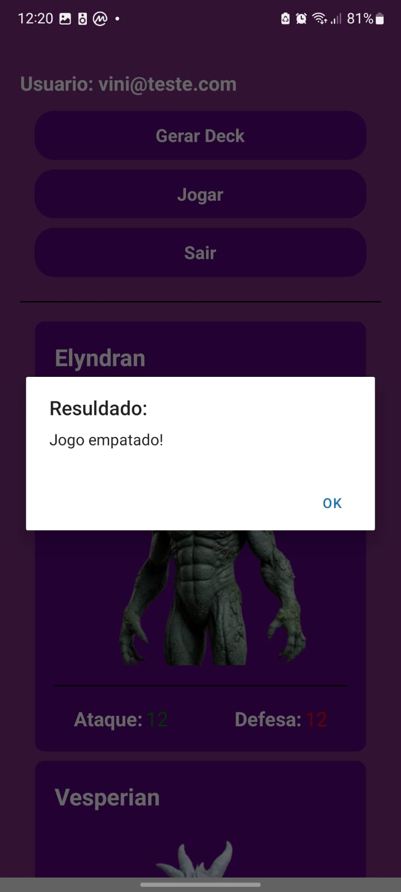

# Projeto CardGame - Ethereal Duel
<div align="center">


### Projeto de um básico card game feito por mim! - Vinicius Araujo
"Imagens by IA"

</div>

## Índice
- <a href="#layout-mobile">Layout mobile</a>
- <a href="#tecnologias-utilizadas">Tecnologias utilizadas</a>
- <a href="#funcionalidades">Funcionalidades</a>
- <a href="#como-rodar-este-projeto">Como rodar este projeto?</a>
- <a href="#como-jogar">Como jogar?</a>
- <a href="">Outras informações</a>

## Layout Mobile

<div widht=>




</div>

## Tecnologias Utilizadas

1. [React Native](https://reactnative.dev/)
2. [Expo](https://expo.dev/)
3. [TypeScript](https://www.typescriptlang.org/)
4. [Node.js](https://nodejs.org/en)

## Funcionalidades

 - [x] Cadastro de Usuários
 - [x] Login
 - [x] Gerar Deck
 - [x] Jogar
 - [x] Logout

## Como rodar este projeto

### OBS: é preciso o repositório do Backend que se encontra no meu [github](https://github.com/galvao22/cardGame_trunfo_backend.git)

```bash
# Clone este repositorio
$ git clone https://github.com/galvao22/cardGame_trunfo_mobile.git

# Acesse a pasta do projeto no seu terminal
$ cd Trunfo

# Instale as dependencias
$ npm install

# Execute a aplicaçao
$ npm start
```

## Como jogar?

É necessário 2 pessoas para jogar. 

Após executar o projeto com um apk, ou simplesmente com o emulador. No desenvolvimento foi utilizado o expo go!

Os usuário irão se registrar com login e senha.

Após registro, cada um irá fazer login no aplicativo, gerar seu deck e iniciar a partida. Um de cada vez por partida começa atacando e o outro defendendo. Após os cálculos entre ataque e defesa, se soma ou diminui os pontos no placar conforme o resultado.

Ao final de 5 partidas, se encerra o jogo e o resultado final é mostrado.

## Outras informações

- OBS: para o aplicativo funcionar, é preciso ter o backend que se encontra no repositorio do meu [github](https://github.com/galvao22/cardGame_trunfo_backend.git).
- Lembre-se de alterar o caminho da api de acesso ao backend.

- Autor: Vinicius Araujo
- [Linkedin](https://www.linkedin.com/in/vinicius-araujo-galvao-de-sousa-9b8a48125/)